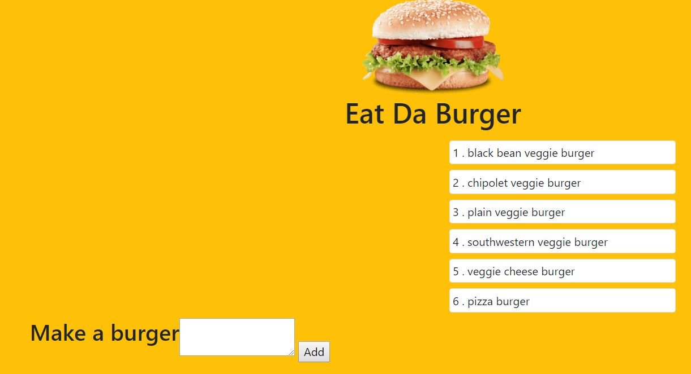
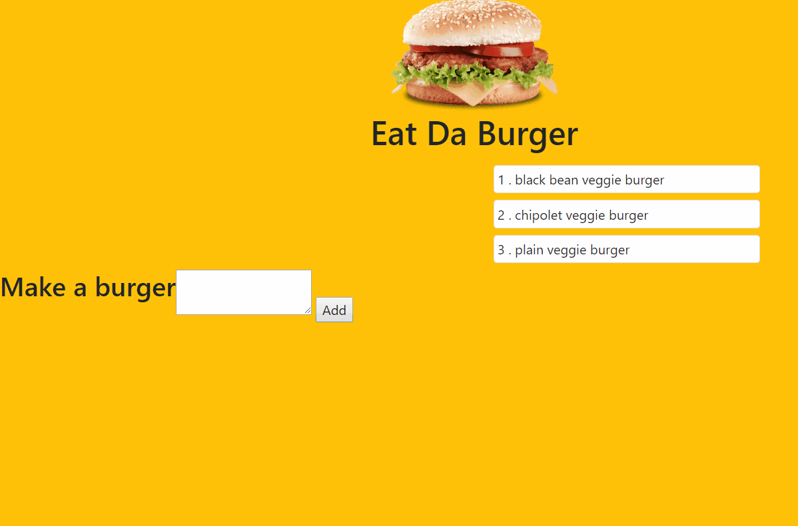
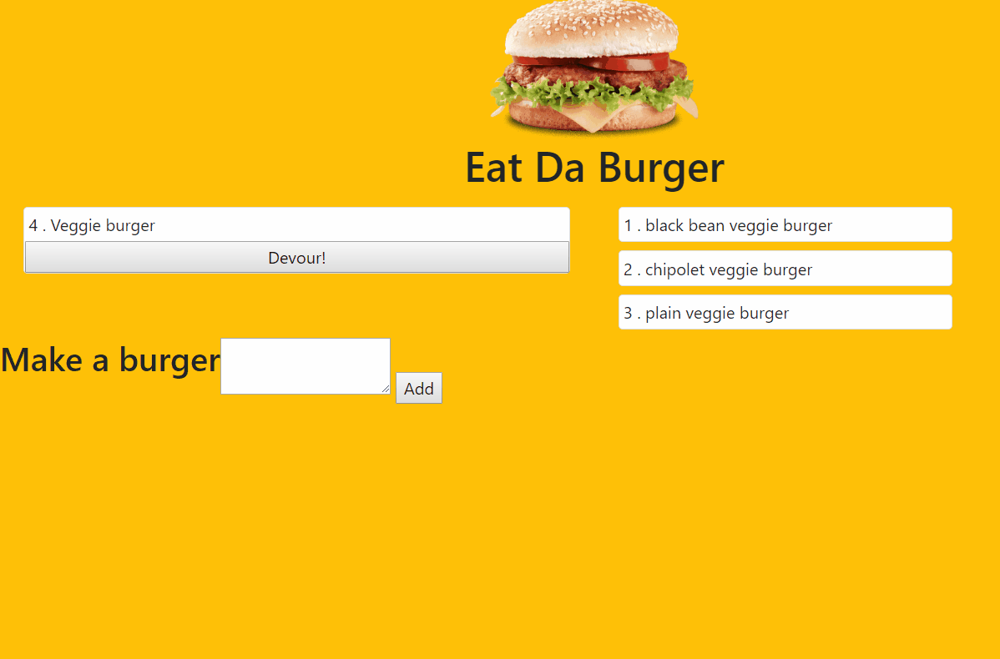

# Burger
## Overview 
The point of this web application is to get practice using the mysql NPM in Node.js to to insert and update the sql database. 

[Click here for the deployed site](https://ancient-ocean-31296.herokuapp.com/ "Deployed Site")

## Website Flow

This is what the websites looks like when the user loads the page. There only option when they load the page is to add a burger.

When the user types in the name of the burger and clicks add it updates the mysql database with the new information.

The final function of this website is to be able to "Devour" the burger. This pushes the burger to the devoured column of the website and updates the mysql so devoured equals true.
